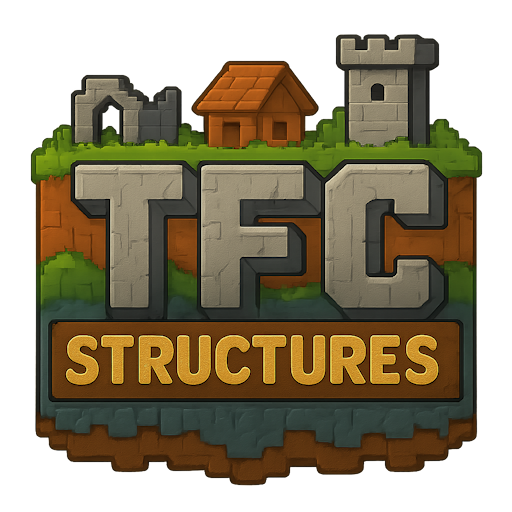

# Dynamic TFC Structures

Did you ever dream to fill your **TerraFirmaCraft** world with authentic structures? Dynamic TFC Structures will bring
them to your world!

Dynamic TFC Structures can activate any world-gen structure and replace their blocks with TerraFirmaCraft analogues like
it was built specially for TFC.\
The mod is also fully configurable, you may find configuration files in **config/tfc\_structures** folder. By default,
only vanilla structures are activated, but you can activate any other modded structure.

## Disclaimer

Be aware that Dynamic TFC Structures is currently in **BETA**, so it **contains bugs** and **there are things to do**.

## Configurations

Dynamic TFC Structures has 3 main configuration files:

* **common-config.toml**\
  _allowedDimensions_ - list of dimensions where structure block will be replaced with TFC blocks
  _biomesTagsStructuresToLogs_ - debug-toggle to output biomes, biome-tags and structures to logs
  _fallbackToTfcStructuresLoot_ - toggle to enable tfc_structures loot tables in case there's no lootTablesOverrideMap
  in structure
  _mossyBlocks_/_strippedLogs_/_strippedWood_/_crackedBricks_ - special tags for replacements. All of them will be
  generated to special block-tags.
* **worldgen\_config.json**\
  _biomeTags_ - definitions of biome-tags that will be generated to `tfc_structures_datapacks/tfc_structures_main`
  datapack. It also contains structures that will be generated in that biome-tag.  
  _disabledStructures_ - list of structures you don't want to see in your world
  _defaultWorldgenStructures_ - list of structures that exist in game, but was not added to any list above, so they will
  use default generation rules. This property will update upon server loading.
* **structures\_config.json**\
  _structures_ - list of replacement rules for every structure, like replacement preset, lootTablesOverrideMap, etc.\
  This configuration will be created(or updated) upon server loading.

Also, there's folder `presets` where you may find replacement presets configuration files.\
Every preset has 3 properties:

- _directReplacements_ - block-to-block map to direct replacement when structure have spawned
- _randomReplacements_ - block-to-many-blocks map to random replacement. perBlock=false means whole structure will use
  one block.
- _tfcWorldReplacements_ - block-to-type map to block replacement with TFC blocks from surroundings(like stone, wood,
  soil, sand or ores)

By default, there are two presets: `no-replace`(empty preset) and `overworld-common`, but you can create another presets
by your own(don't forget to assign preset to structure in `structures_config.json`).

## TFC Structures Datapacks folder

Dynamic TFC Structures generates its own data-pack using configuration files, so it has its own directory for datapacks

- **_tfc\_structures\_datapacks/tfc\_structures\_main_**.\
But you may place YOUR datapacks or KubeJS-like datapack folder(use `tfc_structures_main` datapack as an example)
directly to **_tfc\_structures\_datapacks_** folder, and it will load upon world creation.

## Known issues

* Some structures may be lost(Treasures and Portals)
* Currently, _tfcWorldReplacement_ is not compatible with non-default TFC blocks
  (eg, [ArborFirmaCraft](https://www.curseforge.com/minecraft/mc-mods/arborfirmacraft))