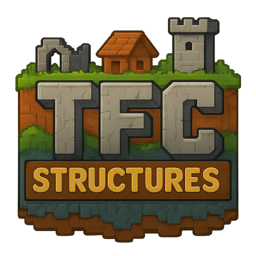

# Dynamic TFC Structures

Did you ever dream of filling your **TerraFirmaCraft** world with authentic structures? Dynamic TFC Structures will
bring
them to your world!

Dynamic TFC Structures can activate any world-gen structure and replace its blocks with TerraFirmaCraft analogues, as if
it were built especially for TFC.\
The mod is also fully configurable; you may find configuration files in the **config/tfc\_structures** folder. By
default,
only vanilla structures are activated, but you can activate any other modded structure.

**Primarily aimed at TerraFirmaCraft modpack authors** — this mod helps you bring vanilla and modded structures into
TFC worlds with configurable block replacements and worldgen rules.

Despite the mod's name, Dynamic TFC Structures may work without TerraFirmaCraft, so feel free to use it in non-TFC
modpacks :)
_But you'll need to build configuration files yourself if you don't have TFC._

## Disclaimer

Be aware that Dynamic TFC Structures is currently in **BETA**, so it **contains bugs** and **there is still work to
do**.

## Configurations

Dynamic TFC Structures has 3 main configuration files:

* **common-config.toml**\
  _allowedDimensions_ - list of dimensions where structure blocks will be replaced with TFC blocks\
  _biomesTagsStructuresToLogs_ - debug toggle to output biomes, biome tags, and structures to logs\
  _fallbackToTfcStructuresLoot_ - toggle to enable tfc_structures loot tables in case there's no lootTablesOverrideMap
  in structure\
  _mossyBlocks_/_strippedLogs_/_strippedWood_/_crackedBricks_ - special tags for replacements. All of them will be
  added to special block tags.
* **worldgen\_config.json**\
  _biomeTags_ - definitions of biome tags that will be generated to `tfc_structures_datapacks/tfc_structures_main`
  datapack. It also contains structures that will be generated in that biome tag.\
  _disabledStructures_ - list of structures you don't want to see in your world\
  _defaultWorldgenStructures_ - list of structures that exist in the game but were not added to any list above, so they
  will
  use default generation rules. This property will update upon server loading.
* **structures\_config.json**\
  _structures_ - list of replacement rules for every structure, like replacement preset, lootTablesOverrideMap, etc.\
  This configuration will be created (or updated) upon server loading.

Also, there's a folder `presets` where you may find replacement preset configuration files.\
Every preset has 3 properties:

- _directReplacements_ - block-to-block map for direct replacement when a structure has spawned
- _randomReplacements_ - block-to-many-blocks map for random replacement. `perBlock=false` means the whole structure
  will use
  one block.
- _tfcWorldReplacements_ - block-to-type map for block replacement with TFC blocks from surroundings (like stone, wood,
  soil, sand, or ores)

By default, there are two presets: `no-replace` (empty preset) and `overworld-common`, but you can create additional
presets
yourself (don't forget to assign a preset to a structure in `structures_config.json`).

If you are annoyed by a lot of structures in one place,
you may also be interested in installing
[Sparse Structures](https://www.curseforge.com/minecraft/mc-mods/sparse-structures).

## TFC Structures Datapacks folder

Dynamic TFC Structures generates its own data pack using configuration files, so it has its own directory for datapacks:

- **_tfc\_structures\_datapacks/tfc\_structures\_main_**\
  But you may place your datapacks or KubeJS-like datapack folders (use the `tfc_structures_main` datapack as an
  example)
  directly in the **_tfc\_structures\_datapacks_** folder, and they will load upon world creation.

_Don't put your files in `tfc_structures_main`, because it will be deleted and re-created for every resource pack
generation._

## Built-in data changes

You should be aware that Dynamic TFC Structures overrides vanilla loot tables to TFC items in the `gameplay` folder,
such as the Cat's morning gift, Hero of the Village reward, Piglin bartering, and Sniffer digging.

## FAQ

### How do I add new structures?

Just start a new world with your structure mods installed. After the first server load, you will find new structures in
`config/tfc_structures/worldgen_config.json` (in the `defaultWorldgenStructures` section) and in
`config/tfc_structures/structures_config.json` (in the `structures` section). Both files are created or updated
automatically when the server is about to start.

What happens under the hood

- `worldgen_config.json` — the mod scans the structure registry and puts every structure that is not listed in
  `biomeTags` or `disabledStructures` into `defaultWorldgenStructures`. Structures in that list keep the biome rules
  from the original mod. To make a structure spawn in TFC biomes, move its ID from `defaultWorldgenStructures` into a
  `biomeTags` entry (create a new one or add it to an existing tag). See the vanilla entries in
  `WorldgenConfig.getDefaultConfig()` for examples.
- `structures_config.json` — every registered structure that is missing from `structures` gets a default entry:
  `replacementPreset: "overworld-common"`, the default empty-chest loot table from `common-config.toml`, and an empty
  `lootTablesOverrideMap`. Adjust the preset, loot overrides, or assign a custom preset from the `presets` folder as
  needed.

**After editing**

Restart the server (or create a new world) so the generated datapack in `_tfc_structures_datapacks/tfc_structures_main`
is rebuilt with your `biomeTags` changes. Block replacement settings from `structures_config.json` are picked up on the
next structure spawn.

**Tip:** enable `biomesTagsStructuresToLogs` in `common-config.toml` to print every structure ID to the log — useful
when you are unsure of the exact resource location.

### How to customize loot tables on structures?

There are three ways:

- Override loot tables of structures directly using a custom datapack (or KubeJS data folder).
- Create your own loot tables using a custom datapack and override vanilla tables with yours for desired structures
  using `lootTablesOverrideMap` in `config/tfc_structures/structures_config.json`.
- Replace items in loot tables using KubeJS + LootJS (you may take a look at how I did that in my modpack TFC: Lost
  Light, in file `kubejs/server_scripts/modpack_loot_replacement.js`). This one is the easier way, as it will be fully
  automatic for all structure loot tables.

## Known issues

* Currently, _tfcWorldReplacement_ is not compatible with non-default TFC blocks
  (e.g., [ArborFirmaCraft](https://www.curseforge.com/minecraft/mc-mods/arborfirmacraft))
* Structures can't spawn on water (including salt and spring water)